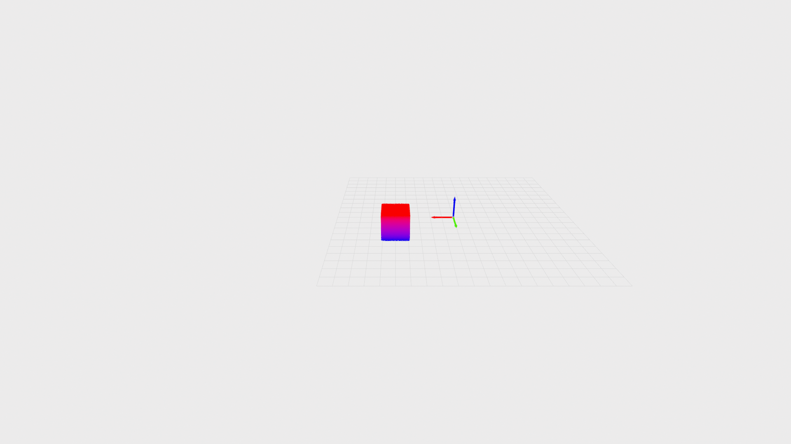

# Warp-MPM Simulation with Animation Generation

This project provides a Material Point Method (MPM) simulation framework modified from [Warp-mpm](https://github.com/zeshunzong/warp-mpm) with automatic animation generation capabilities using Open3D.

## Prerequisites

- Python 3.10 or higher
- CUDA-capable GPU (currently tested on sm-120 only)
- [uv](https://github.com/astral-sh/uv) package manager
- Git

## Installation

### 1. Install uv Package Manager

If you don't have `uv` installed, install it first. For the installation guide, see the [uv documentation](https://docs.astral.sh/uv/getting-started/installation/).

### 2. Clone the Repository with Submodules

This repository contains the `warp-mpm` submodule. Clone with submodules using:

```bash
# Clone with submodules in one command
git clone --recurse-submodules git@github.com:chhsiao93/wp-mpm.git
cd wp_mpm
```

### 3. Install Dependencies

Use `uv` to install all dependencies:

```bash
# Sync dependencies from pyproject.toml
uv sync
```

This will automatically:
- Create a virtual environment
- Install all required packages including:
  - warp-lang (CUDA-accelerated physics engine)
  - PyTorch (with CUDA support)
  - Open3D (3D visualization)
  - imageio and imageio-ffmpeg (animation generation)
  - h5py, numpy, tqdm, and other utilities

## Usage

### Running MPM Simulation

Run the simulation to generate PLY files:

```bash
uv run python main.py
```

### Generating Animations

After running the simulation, generate an animation from the PLY files:

#### Basic Usage

```bash
# Generate MP4 animation with default settings
uv run python generate_animation.py --output animation.mp4
```

#### Recommended Settings with Grid and Axes

```bash
uv run python generate_animation.py \
  --output animation.mp4 \
  --fps 50 \
  --show-grid \
  --grid-size 2.0 \
  --grid-divisions 20 \
  --show-axes \
  --axes-size 0.2
```

#### Generate GIF Instead

```bash
uv run python generate_animation.py \
  --output animation.gif \
  --fps 20 \
  --width 800 \
  --height 600
```
#### Example
<p align="center">
  
</p>
## Acknowledgments

This project uses:
- [NVIDIA Warp](https://github.com/NVIDIA/warp) for high-performance physics simulation
- [warp-mpm](https://github.com/zeshunzong/warp-mpm) for MPM solver implementation
- [Open3D](http://www.open3d.org/) for 3D visualization
